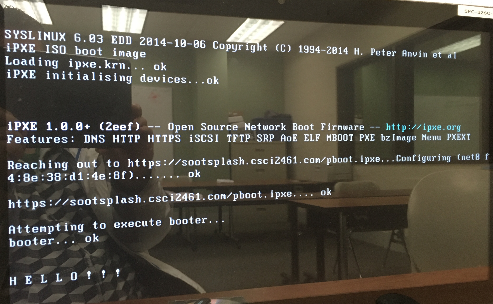

# Oops/Sl@ckers
## Week 14, Documentation of First Results
### Pavel Danek

Greetings to the whole team, I **finally** made some progress and breakthrough on the way to a **customized bootable iPXE USB drive**.
I studied [iPXE website](https://ipxe.org/start), [iPXE source code](https://github.com/ipxe/ipxe) and also [NetBoot.xyz website](https://netboot.xyz) and [NetBoot.xyz source code](https://github.com/antonym/netboot.xyz) to better understand, how their scripts work. Scripts from NetBoot.xyz served me as examples and templates for my own. My Linux class teacher, [Mr. Matthew Harmon](https://github.com/mjhedu) was a big help and advisor to me. I also seeked advice from NetBoot.xyz's programmer, Antony Messerli and iPXE's no.1, Michael Brown.

1. First guideline came from iPXE website, saying: "`clone the iPXE repo; cd ipxe/src; make`". While that was a good start, it would only build a generic iPXE. An important part are packages one needs to install before building iPXE. They're listed [here](https://ipxe.org/download). With liblzma I had a problem; couldn't find it, but I found a solution in the end: '`sudo apt-get install -y liblzma-dev`'.
2. In order to use **https** and port 443, which our server communicates through, I had to "turn on" https, which is by default off in iPXE:

	In ipxe/src/config dir:
	- `nano general.h`
	- on line 57, change `#undef DOWNLOAD_PROTO_HTTPS` to `#define DOWNLOAD_PROTO_HTTPS`, save and exit
3. Next obstacle was an error with missing boot image 'isolines.bin'. The solution was found for me as follows:

	In your home directory:
	- `wget https://mirrors.edge.kernel.org/pub/linux/utils/boot/syslinux/syslinux-6.03.zip`
	- `mkdir syslinux-6.03`
	- `cd syslinux-6.03`
	- `unzip ../syslinux-6.03.zip`

	In ipxe/src directory (assuming it's in your home dir) (in my case, add the embedded file):
	- `make ISOLINUX_BIN=/home/<your home dir>/syslinux-6.03/bios/core/isolinux.bin LDLINUX_C32=/home/<your home dir>/syslinux-6.03/bios/com32/elflink/ldlinux/ldlinux.c32 EMBED=/<path to your embedded file>/<filename>`
4. Then I went to ipxe/src/bin and copied "ipxe.iso".
5. I brought it to Windows environment and using USB burning software Rufus and ipxe.iso file, I created a bootable USB
6. When booting from it, iPXE environment calls my custom script, [pavelboot](Scripts/pavelboot), which finds our server and starts [pboot.ipxe](Scripts/pboot.ipxe), which then calls the Windows bootloader (its path is in the variable TARGET, for now pointing to temporary script called [booter](Scripts/booter), that has no other function but to demonstrate the execution of a real boot loading file.
7. The final result looks something like this:

Now we have to figure out the "Windows part", or how to get a bootable Windows 7 on our server!

Good luck to us all!

I'll see you in class!

-Pavel.
